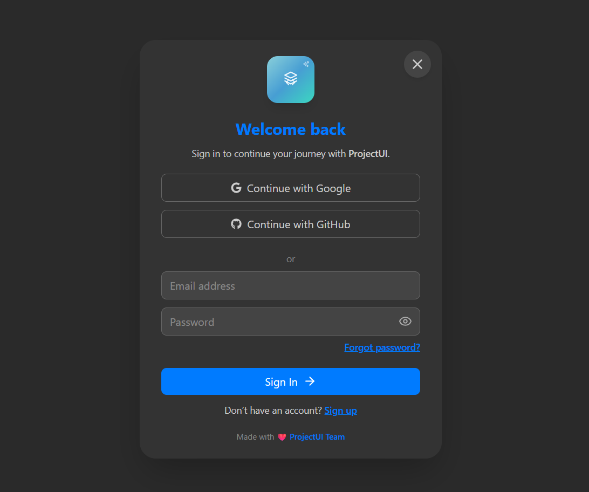

# 🚀 ProjectUI Components

Beautifully designed and production-ready React components powered by **Tailwind CSS**, **Framer Motion**, and **Lucide React**.  
Just plug them in, customize your logo, and start building beautiful, animated user interfaces in minutes! ⚡

---

## 🌟 Get Started

👉 **Follow the folder structure** — or simply **clone the repository and give it a ⭐ on GitHub** to show your support!  
Either way, you’ll get a fully working setup with zero extra configuration needed.

---

## 🧠 Quick Setup

1. Clone or fork the repository.  
2. Open the project folder in your editor.    
3. Customize the **logo** and **paths** using the comments provided in the code.  
4. Run the app and enjoy your new UI components!

---

## 🪄 Installation

Make sure you have **Node.js** and **npm** installed.  
Then install all required dependencies using:

npm i @tailwindcss/vite framer-motion lucide-react react react-dom react-hot-toast react-icons react-router-dom tailwindcss

---

⚙️ Setup & Customization Notes

1. 🧩 Folder Structure

Stick to the provided folder layout or simply clone this repo — both methods give you a complete, working ProjectUI setup.

2. 🪪 Logo Creation

You’ll find comments in your code marking where the logo logic starts and where it ends.
Use that section to create your own animated or static logo for your project.
This helps make your version of ProjectUI truly yours — sleek, unique, and personal. ✨

4. 🧭 Add Your Own Paths

In several files, comments clearly mark where to add or edit routes and paths for your own pages.
Follow those notes to connect new components, pages, or sections effortlessly.

5. ✏️ App Name Replacement

All instances of “ProjectUI” in the codebase can easily be replaced with your own web app name.
Each occurrence is clearly marked via inline comments — so rebranding is quick and consistent.

6. 💬 In-Code Comments & Guidance

Every component and page includes meaningful inline comments explaining what to edit, why, and how.
Follow them to adapt colors, text, structure, or animations with confidence.

---

🎨 Tech Stack

⚛️ React — modern component-based UI library

💨 Tailwind CSS — fast, utility-first styling framework

🎞️ Framer Motion — silky-smooth animations

🧩 Lucide React — open-source icon library

🔥 React Hot Toast — clean toast notifications

🚦 React Router DOM — for navigation and routing

🧠 Vite + Tailwind Integration — lightning-fast build system

---

💡 Customization

Every element in ProjectUI is fully customizable using Tailwind classes.
Tweak color palettes, animations, spacing, or layout directly in the markup.

---
❤️ Credits

Built with passion by Anshitva and team, for developers.
Enjoy using ProjectUI Components and bring life to your interfaces with minimal effort and maximum creativity 🌈

---
📸 Preview
